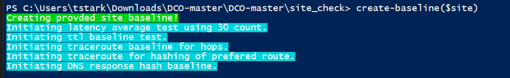
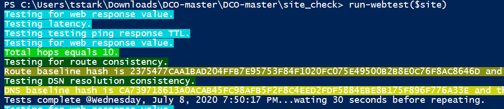
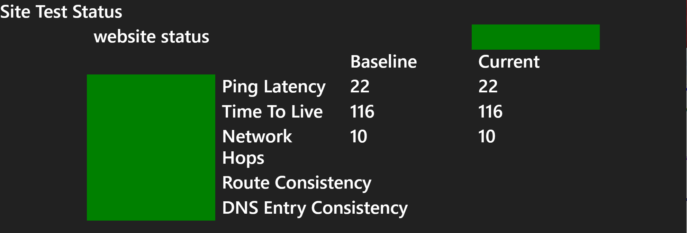

# WebMonitor
Repo for site route, dns and availability testing PowerShell based application. 

What does this do?

Let's talk about site security when it really matters!

Here is how you use it!

1. Download the repo.
2. Unzip if needed!
3. Edit "site_check_main.ps1" where the comments say "YOU NEED TO CHANGE THESE" you should change the variables pointing to the required folders in the downloaded and extracted folder.
4. Also, change the site to the site you would like to check!
5. Now run the whole scipt.
6. With the functions loaded, time to create a baseline, run create-baseline($site).

7. Kown good state recorded, run the continuous test with run-webtest($site)

8. Now non of this makes sense with out a live GUI to show all your friends, in a separate terminal in the webmonitor folder, run > ./php/php.exe -S localhost:8080
9. Browser to your website test, checking every 30 seconds or the specified interval for potential manipulation of traffic to and from your website.

That's it!

Improvments on the way:

- [ ] Condence workflow to one command that also launches the website.
- [ ] terraform deploy script to azure.
- [ ] Multi cloud warehouse hosting to compare deviations in traffic to a site from differnt parts of the world.
- [ ] Integrate with known BGP activity data.
